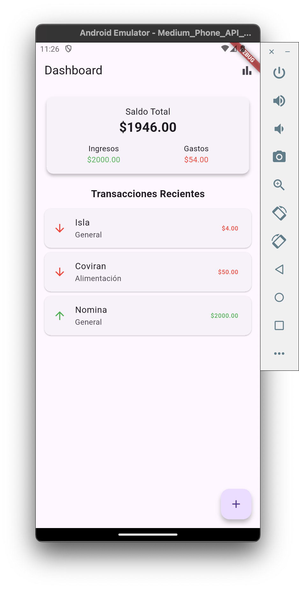

# 💰 **Gestor de Finanzas Personales**


> 📱 Una app móvil moderna hecha con **Flutter**, diseñada para ayudarte a **gestionar tus gastos e ingresos personales**.  
> Guarda tus transacciones localmente, visualiza estadísticas interactivas y mantén tus finanzas organizadas.

---

## 🧭 **Índice**

1. [Características](#-características)
2. [Capturas de Pantalla](#-capturas-de-pantalla)
3. [Tecnologías Usadas](#-tecnologías-usadas)
4. [Estructura del Proyecto](#-estructura-del-proyecto)
5. [Instalación y Uso](#-instalación-y-uso)
6. [Próximas Mejoras](#-próximas-mejoras)
7. [Autor](#-autor)

---

## ✨ **Características**

- 📊 **Dashboard intuitivo**: visualiza tus transacciones de manera clara y rápida.  
- ➕ **Agrega, edita o elimina** ingresos y gastos fácilmente.  
- 💾 **Persistencia local** con [Hive](https://docs.hivedb.dev/) — sin conexión a internet.  
- 🎨 **Interfaz moderna** siguiendo Material Design 3.  
- 📈 **Gráficos animados** con [fl_chart](https://pub.dev/packages/fl_chart).  
- ⚙️ **Arquitectura modular** con separación de lógica, UI y almacenamiento.  
- 🕒 **Balance en tiempo real** y resumen financiero instantáneo.

---

## 🖼️ **Capturas de Pantalla**

> *(Agrega aquí tus imágenes más adelante, por ejemplo:)*

| Dashboard | Agregar Transacción | Estadísticas |
|------------|--------------------|---------------|
|  |  |  |

---

## 🧱 **Estructura del Proyecto**

```
lib/
 ┣ models/
 ┃ ┗ transaction.dart            → Modelo Hive de transacción
 ┣ screens/
 ┃ ┣ dashboard_screen.dart       → Pantalla principal
 ┃ ┣ add_transaction_screen.dart → Formulario de ingreso/edición
 ┃ ┗ statistics_screen.dart      → Gráficos animados
 ┣ widgets/
 ┃ ┗ transaction_card.dart       → Tarjeta individual de transacción
 ┗ main.dart                     → Punto de entrada de la app
```

---

## 🧰 **Tecnologías Usadas**

| Tecnología | Descripción |
|-------------|--------------|
| 🐦 **Flutter** | Framework principal multiplataforma |
| 💾 **Hive** | Base de datos local sin servidor |
| 📊 **fl_chart** | Gráficos de pastel y barras animados |
| 🎨 **Material 3** | Diseño moderno y coherente |
| ⚙️ **build_runner** | Generador automático de adaptadores Hive |

---

## 🚀 **Instalación y Uso**

1. **Clona el repositorio**
   ```bash
   git clone https://github.com/tuusuario/gestor-finanzas-flutter.git
   cd gestor-finanzas-flutter
   ```

2. **Instala dependencias**
   ```bash
   flutter pub get
   ```

3. **Genera los adaptadores de Hive**
   ```bash
   dart run build_runner build --delete-conflicting-outputs
   ```

4. **Ejecuta la app**
   ```bash
   flutter run
   ```

---

## 🧩 **Próximas Mejoras**

- 🔍 Filtros avanzados (por fecha y categoría).  
- 📆 Gráficos de barras mensuales (resumen histórico).  
- 📤 Exportar transacciones a CSV o PDF.  
- ☁️ Sincronización en la nube (Firebase o Supabase).  
- 🔐 Autenticación biométrica o PIN de acceso.  

---

## 💡 **Ejemplo de Funcionalidad**

> 💬 “Gané $1500 este mes, gasté $800 en compras y $200 en ocio.”  
> La app mostrará un **balance positivo de $500** y gráficos de pastel con cada categoría visualmente diferenciada.

---

## 👨‍💻 **Autor**

**Tu Nombre**  
📧 [tuemail@example.com](mailto:jualocor13@gmail.com)
💻 [GitHub](https://github.com/jualocor13)

---

## 📝 **Licencia**

Este proyecto está bajo la licencia **MIT**.  
Puedes usarlo, modificarlo y distribuirlo libremente, siempre que se mantenga la atribución al autor original.
